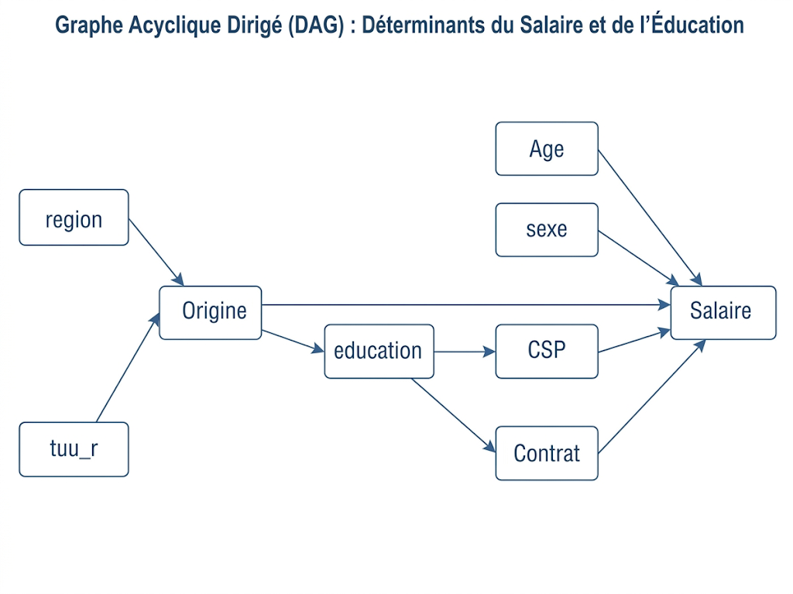

```{r packages, message=FALSE, warning=FALSE}
# Installation des packages
install.packages("haven")
install.packages("estimatr")
install.packages("tidyverse")
install.packages("fastDummies")
install.packages("corrplot")
install.packages("rstatix")
install.packages("modelsummary")
install.packages("plm")
install.packages("ggdag")
#-------------------------------------------------------------
library(haven) 
library(plm)
library(rstatix)
library(estimatr)
library(tidyverse)
library(fastDummies)
library(modelsummary)
library(corrplot)
```

# I. Présentation du projet

Ce projet vise à mesurer l’effet de différentes variables individuelles sur la position sur le marché du travail, en particulier l’impact de l’origine des individus sur le salaire horaire et le chômage.

Les données proviennent d’un panel de 10 000 individus suivis sur 6 trimestres (2014-2016).

Les principales variables sont :

-   **Marge intensive** : salaire net horaire (`salhoraire`, `logsalhoraire`)
-   **Marge extensive** : statut sur le marché du travail (actif occupé, chômeur, inactif)
-   **Variables individuelles** : âge, sexe, diplôme, CSP des parents, origine, indicatrices immigré/descendant, état de santé, situation matrimoniale…
-   **Variables géographiques** : région, tranche d’unité urbaine , proportions de populations d’origines différentes...

L’objectif est de déterminer si l’origine affecte le salaire et l’accès à l’emploi, toutes choses égales par ailleurs.

Avant de passer à l’analyse économétrique, il est important de s’approprier la base de données et de comprendre les caractéristiques principales des individus suivis.

La base contient **10 000 individus** observés sur 6 trimestres (2014-2016). On dispose d’informations sur les caractéristiques individuelles (âge, sexe, diplôme, origine, état de santé, situation matrimoniale), les caractéristiques professionnelles (statut sur le marché du travail, salaire, heures travaillées, type de contrat) ainsi que sur l’environnement géographique (région, tranche d’unité urbaine, proportion de populations d’origines différentes).\
Cette étape est essentielle pour **s’assurer de la qualité des données**, guider le choix des variables explicatives et préparer l’analyse économétrique qui suit.

### 1) Chargement de la base de données

Nous commençons par importer la base de données fournie pour le projet.

Le code suivant permet de lire le fichier `.dta` et de vérifier ses dimensions (nombre de lignes et de colonnes) :

```{r, echo=TRUE}
df <- read_dta("DM_Subject_2_Data.dta")
dim(df)  

```

### 2) Statistiques descriptives

```{r, echo = FALSE}
# On construit le graphique avec le vrai label des modalités
df$origine_label <- factor(df$origine,
  levels = c("01","03","04","05","06","07","08","09","10","99"),
  labels = c(
    "France",
    "Europe du Nord",
    "Europe du Sud",
    "Europe de l'Est",
    "Maghreb",
    "Reste de l'Afrique",
    "Proche-Orient",
    "Asie du Sud-Est",
    "Reste du monde",
    "Non renseigné"
  )
)

df$acteu_label <- factor(df$acteu,
  levels = c("1","2","3"),
  labels = c("En emploi", "Chômage", "Inactif")
)

df$education_label <- factor(df$education,
  levels = c("1","3","4","5","6","7"),
  labels = c(
    "Supérieur > Bac+2",
    "Bac+2",
    "Bac",
    "CAP/BEP",
    "Brevet",
    "Sans diplôme"
  )
)


```

```{r, echo=FALSE}

par(mfrow = c(1,2), mar = c(6,4,3,1), cex.axis = 0.8)

# 1. Origine
barplot(
  prop.table(table(df$origine_label)),
  col = "steelblue",
  las = 2,
  main = "Répartition par origine"
)

# 2. Salaire (log)
boxplot(
  logsalhoraire ~ origine_label,
  data = df,
  col = "lightgray",
  las = 2,
  main = "Salaire (log) par origine",
  outline = FALSE
)

# 3. Statut emploi
tab <- prop.table(table(df$origine_label, df$acteu_label), 1)

barplot(
  t(tab),
  col = c("darkgreen", "orange", "red"),
  legend = TRUE,
  las = 2,
  main = "Statut d'emploi par origine"
)

# 4. Education
tab_ed <- prop.table(table(df$origine_label, df$education_label), 1)

barplot(
  t(tab_ed),
  col = rainbow(6),
  legend = TRUE,
  las = 2,
  main = "Éducation par origine"
)

par(mfrow = c(1,1))
```

L'échantillon est massivement dominé par l'origine française (plus de 80 %). On observe une hétérogénéité marquée du capital humain : les populations originaires du Maghreb et Asie du Sud-Est présentent une part importante de non-diplômés, tandis que les origines d'Europe du Nord ou du Reste du monde affichent des taux de diplômes supérieurs élevés. Cette stratification éducative initiale confirme que le diplôme est un canal de transmission majeur des inégalités salariales qu'il faudra isoler.

Sur le marché du travail, les disparités sont visibles dès l'accès à l'emploi (marge extensive) : les origines africaines et maghrébines affichent des parts de chômage plus prononcées que la moyenne. Côté salaires (marge intensive), si les médianes des logs-salaires semblent globalement alignées, on distingue un tassement vers le bas pour le Reste de l'Afrique et l'Asie du Sud-Est. La forte dispersion dans tous les groupes, couplée à ces différences de médianes malgré des profils éducatifs parfois élevés, justifie la problématique de recherche d'un effet direct de l'origine au-delà des seules caractéristiques productives.

# II. Marge Intensive

Dans un premier temps, on étudie le salaire des actifs occupés et on s’intéresse à l’existence de potentielles inégalités salariales dues à l’origine. Le salaire n’est disponible qu’au premier et au dernier trimestre : données de panel avec T = 2 pour cette variable.

### Question 1 – Effet de l’origine sur le salaire horaire

Dans cette première partie, on s’intéresse à l’existence d’éventuelles inégalités salariales liées à l’origine des individus. Conformément à l’énoncé, on se restreint aux individus **actifs occupés** et on utilise uniquement **le dernier trimestre observé**, ce qui revient à travailler sur une coupe transversale des données.

#### **a) Modèle et choix de variables**

Afin d'identifier un effet causal, il est nécessaire de:

1.  Inclure tous les **cofounders** (variables correlées à la fois à l'origine et au salaire);

2.  Inclure toutes les variables correlées uniquement au salaire;

3.  Ne pas inclure les variables à mi-chemin entre **Origine** et **salaire** pour éviter un biais de variable incluse.

Ceci nous conduit donc à retenir:

-   **L'Origine**: c'est le coeur de l'étude; la variable dont on cherche l'effet sur le salaire;

-   **L'âge** et \$**l'âge\^2**\$: c'est un proxy de l'ancienneté.On l'inclut comme proxy de l'expérience professionnelle;

-   **Le sexe**: pour capter les inégalités de salaire pourvant exister entre hommes et femmes;

-   **La région** et la **tranche d'unité urbaine**: pour contrôler les spécificités du marché du travail local, et neutraliser l'effet de concentration des immigrés dans certaines villes où les salaires sont élevés;

-   **L'éducation**: car le niveau de diplôme influence fortement le salaire, et ne pas l'inclure produirait un biais.

Dans la même logique, on choisit de ne pas contrôler les variables comme la catégorie socioprofessionnelle (CSP), et le type de contrat. En effet, si jamais il y'a de la discrimination à l'embauche du fait de l'origine, contrôler par ces variables reviendrait à neutraliser une partie de l'effet de l'origine sur le salaire.

Par ailleurs, il est tout à fait possible que l'éducation soit un canal par lequel l'origine influence le salaire; mais pour l'instant on choisit d'ignorer cela car ce sera abordé dans les questions suivantes.

Le DAG (Directed Acyclic Graph) suivant résume notre schéma de modélisation:



#### **b) Interprétation**

Tous les modèles estimés ne peuvent s'interpréter qu'en termes de prédiction et non de causalité. En effet, l'hypothèse d'abscence de biais de sélection est très peu crédible; bien qu'on ait contrôlé par certaines variables pertinentes.

Les interprétations suivantes, se feront (pour des besoins de simplicité) uniquement sur les personnes originaires d'afrique.

On va entraîner les deux modèles, mais de façon progressive en ajoutant des nouvelles variables au fur et à mesure, et voir comment les coefficients évoluent.

```{r}
#--------------------QUESTION 1--------------------------------
df1 <- df %>%
  filter(t == 6, acteu == 1)%>%
  mutate(
    age2  = age^2
  ) %>%
  droplevels()


regression <- function(y, data = df1){
  
  # On convertit l'argument en caractère 
  y <- deparse(substitute(y))
  
  # Définition des listes de variables explicatives
  rhs1 <- "origine"
  rhs2 <- c(rhs1, "age", "age2", "homme")
  rhs3 <- c(rhs2, "region", "tuu_r")
  rhs4 <- c(rhs3, "education")
  rhs5 <- c(rhs4, "csp_actif", "contrat")
  
  # Estimation des modèles
  m1 <- lm_robust(reformulate(rhs1, y), data = data)
  m2 <- lm_robust(reformulate(rhs2, y), data = data)
  m3 <- lm_robust(reformulate(rhs3, y), data = data)
  m4 <- lm_robust(reformulate(rhs4, y), data = data)
  m5 <- lm_robust(reformulate(rhs5, y), data = data)
  
  # On regroupe pour le tableau
  models <- list(
    "modèle(1)" = m1, 
    "modèle(2)" = m2, 
    "modèle(3)" = m3, 
    "modèle(4)" = m4, 
    "modèle(5)" = m5
  )
  
  # Rendu du tableau
  modelsummary(
    models,
    stars = TRUE,
    coef_omit = "Intercept",
    gof_omit = "AIC|BIC|Log.Lik|F|Std.Errors",
    title = paste("Analyse de la variable :", y),
    notes = "Écarts-types robustes (HC2)."
  )
  
}
  # a) Modèle LOG 
regression(logsalhoraire)
# a) Modèle en niveau 
regression(salhoraire)
```

Toutes choses égales par ailleurs, le modèle 1 prédit qu’un individu originaire d'Afrique gagne en moyenne **8,40 \$/h de moins** qu’un Français (soit une pénalité de **17,8 %** selon la spécification en log). Ce résultat est statistiquement significatif au seuil de **1 %**. L'ajout des variables de contrôle (âge, sexe et zone géographique) affine l'estimation, mais le signe, l'ampleur et la significativité de l'effet demeurent **robustes**.

En contrôlant en plus par l'**éducation** (modèle 4), l'écart se réduit légèrement mais reste massif : un individu originaire d'Afrique gagne désormais, toutes choses égales par ailleurs, **7,71 \$/h de moins** qu'un Français (soit **15 %** en moins dans le modèle en log). La persistance de cet effet, même à diplôme identique, suggère qu'une part prépondérante de l'inégalité salariale est directe et ne s'explique pas uniquement par des différences de capital humain. L’ajout de **éducation** provoque en plus une hausse substantielle du $R^2$ (passant de **8,3%** à **25,1%**). Cette progression démontre que le capital humain est le principal facteur explicatif de la variance des salaires dans notre échantillon.

Enfin, le modèle 5 intègre la CSP et le type de contrat. L’effet de l’origine devient beaucoup plus fragile. Le coefficient n’est plus significatif dans le modèle en niveau et ne l’est qu'au seuil de **10 %** dans le modèle en log. Ce résultat suggère qu’à CSP et type de contrat identiques, l’écart de salaire horaire tend à s’estomper statistiquement. En d'autres termes, l’essentiel du désavantage lié à l’origine constaté dans les modèles précédents semble transiter par une **ségrégation professionnelle** (accès plus difficile aux postes qualifiés et aux contrats stables) plutôt que par une inégalité de rémunération directe au sein d’un même poste.

#### **c) Canaux de transmission de l'effet de l'origine sur le salaire**

Les régressions précédentes met en évidence une pénalité de 17,8% pour les individus d'origine africaine par rapport aux français (modèle 1). L'introduction du niveau d'éducation (modèle 4), ne réduit cet écart qu'à 15,5%; ce qui suggère que la disparité salariale ne résulte pas principalement d'une différence de capital humain. L'éducation, bien que élément important du salaire, n'explique qu'une faible part de l'inégalité liée à l'origine.

En ajoutant la CSP et le type de contrat (modèle 5), on observe un effondrement de l'amplitude des coefficients de l'éducation, et une chute de la pénalité à 6,7%. Cela prouve qu'une grande partie du rendement de l'éducation transite par le canal de **l'insertion professionnelle**. La CSP et le contrat absorbent donc une partie de l'effet de l'éducation (et de l'origine).

Finalement, ces résultats révèlent 02 possibles formes de discrimination. D'une part, **une discrimination à l'embauche (prépondérante):** l'origine impacterait l'obtention de statuts particuliers (cadres) ou de contrats stables (CDI). D'autre part, **une discrimination à la rémunération (pure)**, qui subsiste même à poste et contrat identiques.

### Question 2 – Inclure le niveau de diplôme comme variable de contrôle

#### **a) Problème qui peut survenir en contrôlant par le niveau de diplôme**

Dans cette partie, on s'intéresse à l'effet de l'origine sur le salaire. Si la réalité est telle que l'origine influence le salaire à travers le niveau d'éducation, alors en contrôlant par l'éducation, on commet un **biais de variable incluse** puisqu'on bloque un chemin causal. Par conséquent, le coefficient de Origine est biaisé vers le bas, et ne mesure que l'effet "**à niveau d'éducation égal**".

De plus, l'éducation est certainement endogène ici, car il n'est certainement pas choisi au hasard par les individus (actifs occupés) de notre échantillon. Il est donc correlé aux facteurs inobservés.

#### **b) Variables disponibles pour instrumenter l'éducation**

Comme instruments, on peut utiliser: la catégorie socio-professionnelle des parents.

-   Pertinence: La CSP des parents devrait être correlée au niveau d'éducation de l'enfant, notamment en raison de l'héritage culturel et/ou la reproduction sociale. Un enfant ayant des parents qui sont professeurs d'université par exemple, aura tendance à poursuivre ses études jusqu'au master au moins (ou Doctorat), contrairement à un enfant d'ouvriers.

-   Exogénéité: Elle repose sur une hypothèse qui est discutable: l*a profession des parents n'influence le salaire de l'enfant que par le niveau diplôme*. En pratique, les enfants peuvent très biens bénéficier des "connexions" ou du "réseau" de leurs parents pour décrocher des emplois bien rémunérés.

    ```{r}
    #--------------------QUESTION 2-----------------------------

              #--------Pertinence----------
    m_iv <- iv_robust(
      logsalhoraire ~ origine + age + age2 + homme + region + tuu_r + education | 
        origine + age + age2 + homme + region + tuu_r + csp_mere,
      data = df1,
      diagnostics = TRUE # TRÈS IMPORTANT pour avoir le F-test
    )

    summary(m_iv)

    ```

Les tests de diagnostic indiquent que nos instruments (CSP de la mère) sont globalement **pertinents**. Pour la plupart des niveaux d'éducation, la statistique F est proche ou supérieure à **10**, ce qui correspond à la règle empirique usuelle pour écarter le risque d'instruments faibles. On note toutefois une faiblesse relative pour le niveau `education6` ($F = 5,55$). Néanmoins, les p-valeurs extrêmement faibles ($< 2e-16$) sur l'ensemble des modalités confirment que la CSP des parents reste un prédicteur significatif du parcours scolaire, permettant ainsi une identification du modèle.

De plus, le test de sargan confirme (au seuil de 10%), que la CSP des parents n'impacte le salaire qu'à travers le niveau d'education de l'enfant. Le test de Wu-Hausmann suggère que l'estimateur MCO n'était pas nécessairement biaisé de mainère significative par des variables omises. Dans ce cas, l'approche IV sert principalement de **test de robustesse.**

#### **b) Interprétation des résultats**

```{r}
        #-------Estimation------------
m_ols <- lm(logsalhoraire ~ origine + age + age2 + homme + region + tuu_r + education, data = df1)
models_iv <- list(
  "Modèle 4" = m_ols, # le modèle précédent
  "IV (2SLS)" = m_iv
)

modelsummary(
  models_iv,
  stars = TRUE,
  coef_omit = "Intercept",
  gof_omit = "AIC|BIC|Log.Lik|F|Std.Errors",
  title = "Comparaison MCO vs Variables Instrumentales",
  notes = "Instruments : CSP de la mere."
)
```

Le passage du MCO à l'IV montre une **grande stabilité des coefficients**. D'un point de vue quantitatif, à caractéristiques égales, un africain a un salaire horaire inférieur de 14,4% à celui d'un français.. Ce résultat étant significatif au seuil de 5%.

Ces résultats confirment que l'origine a un effet direct sur la rémunération, indépendant du parcours scolaire. Enfin, notons que l'IV et les MCO produisent des résultats très similaires (voir coef. Origine), comme le suggérait le test de Wu-Hausman.

### Question 3 – On reconsidère la structure de panel

On considère les observations au premier et au dernier trimestre pour les individus actifs occupés.

#### **a) Regression Pooled**

Si l'on suppose l'exogénéité des résidus et effets fixes individuels, alors le modèle approprié est une "pooled OLS". Dans ce cadre, le coefficient $\beta$ de la régression est convergent et sans biais.

```{r}
 #---a) Modèle avec exogénéité des résidus et des effets fixes individuels---
df_panel <- df %>%
  filter(t %in% c(1, 6), acteu == 1) %>%
  mutate(age2 = age^2) %>%
  group_by(id_individu) %>%
  filter(n() == 2) %>%
  ungroup()

      #Estimation MCO Empilé (Pooled OLS)

m3a <- plm(
  logsalhoraire ~ origine + age + age2 + homme + region + tuu_r + education,
  data = df_panel,
  model = "pooling"
)

# Ecarts-types robustes (Clustered par individu)
summary(m3a, vcov = vcovHC(m3a, type = "HC1", cluster = "group"))
```

Le modèle **Pooled OLS** confirme la persistance d'une pénalité salariale de **15,38 %** pour les africains, résultat hautement significatif ($p < 0,01$) et cohérent avec les analyses en coupe transversale précédentes.

#### **b) Inclure l'origine ? Endogénéité ?**

L'origine est une caractéristique propre d'un individu; il est donc de fait un effet fixe. Ainsi, on peut très bien l'inclure dans la régression pooled de la question 3a.

Cependant, le passage au panel "empilé" ne résout pas l'**endogénéité**. En effet, le Pooled OLS hérite des mêmes limites que le MCO classique : il suppose que le "talent" inobservé n'est pas corrélé à l'origine ou au diplôme. La persistance du coefficient de $-0,1538$ indique donc que, tant qu'on ne neutralise pas les effets fixes individuels le diagnostic reste identique : une part majeure de l'inégalité de l'origine résiste au contrôle par le capital humain, sans que l'on puisse encore affirmer s'il s'agit de pure discrimination ou d'un biais de variables omises persistant.

#### **b) On ne suppose plus l'exogénéité stricte. Peut-on étudier l'effet de la variable Origine ?**

Si l'on autorise les effets individuels à être corrélés avec les régresseurs, alors deux méthodes s'offrent à nous: *le Within et le First-Difference*; ces méthodes visant à supprimer les effets fixes. L'origine étant un effet fixe, il est impossible dans ce cadre d'étudier l'effet de la variable "origine" sur le salaire.
